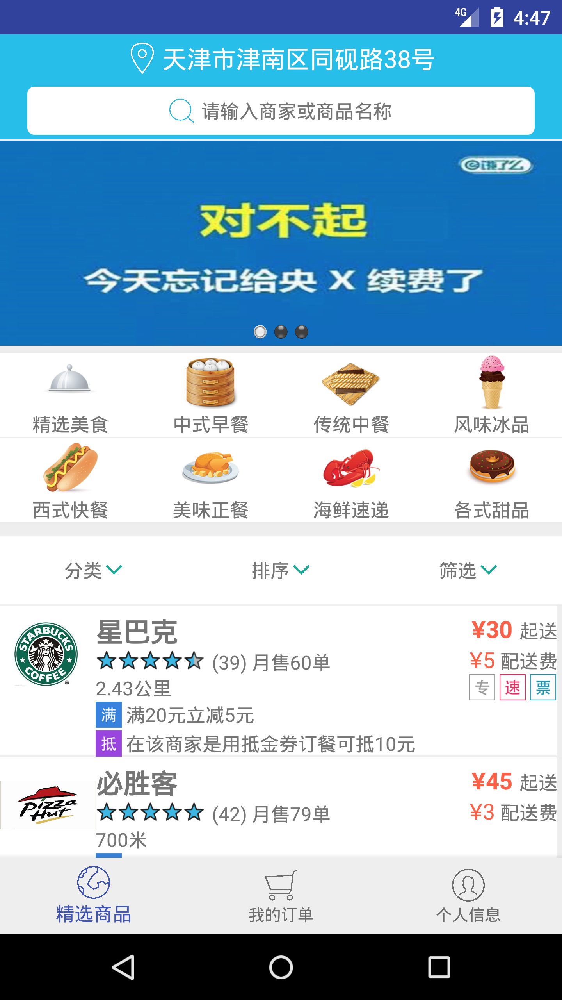

#Hafu-Project_android
使用AndroidStudio开发的Hafu小组的"饿死了么"外卖订餐系统安卓端
请结合 [Hafu-Project](https://github.com/a1liz/Hafu-Project) 使用用户相关功能
 -------
## MainPage
仿造饿了么微信小程序的页面效果

-------
## QuickStart
将/Hafu/src/main/res/values/strings.xml中的
``` xml
<string name="ip">192.168.1.135</string>
```
ip部分改为自己本地的ip地址

------
##已完成的部分
- **用户登录注册模块**
- **将已登录的用户信息暂存至缓存**
- **修改头像**
- **用户地址信息修改**
- **主页展示部分静态商家信息**
- **查看静态订单信息以及订单内容**

-----
##尚未完成的部分
- **商家以及订单信息动态化**
- **主页搜索功能**
- **个人头像上传**
- **个人信息修改**
- **接入第三方用户接口**

-----
## 开发人员
hafu小组

-----
欢迎fork，欢迎star